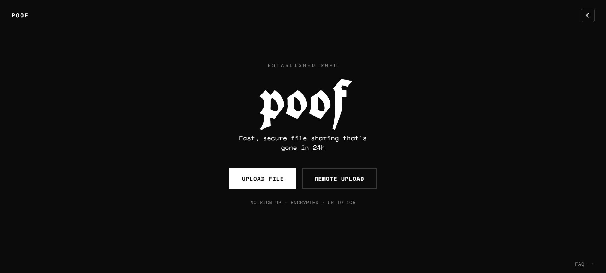
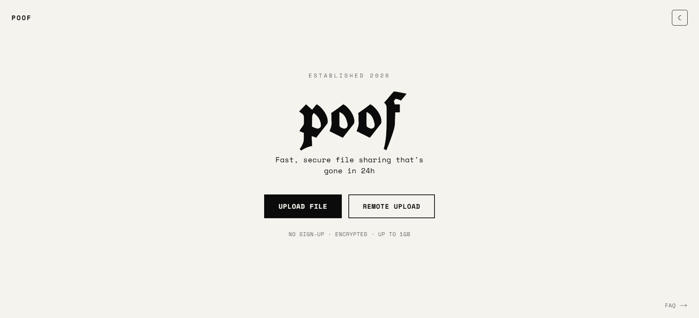
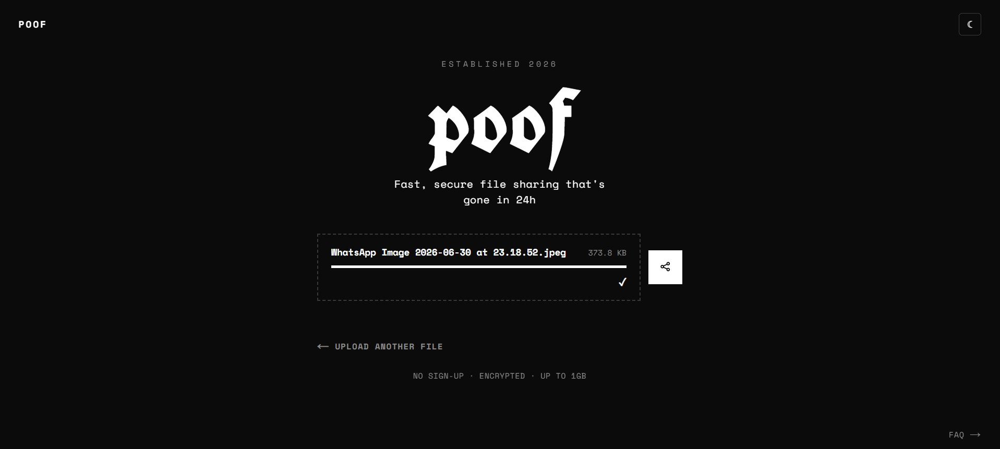
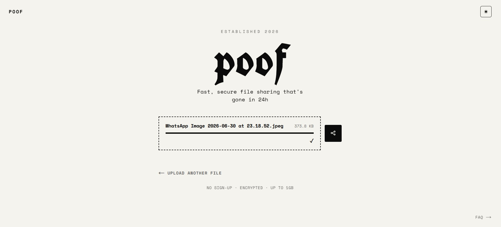
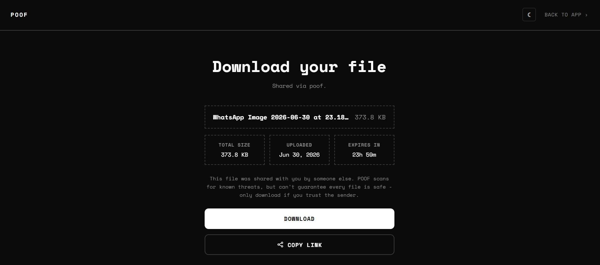
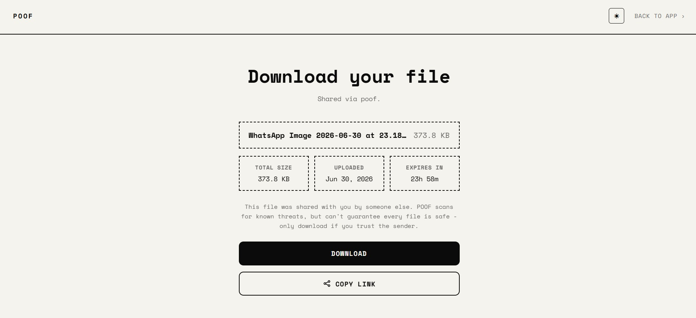
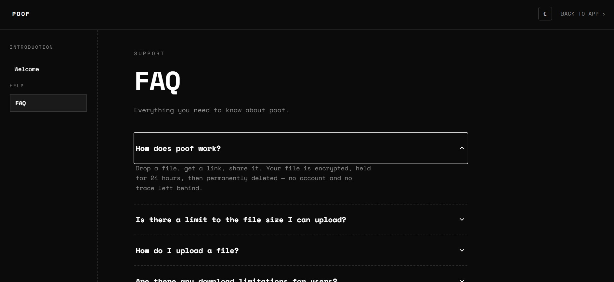
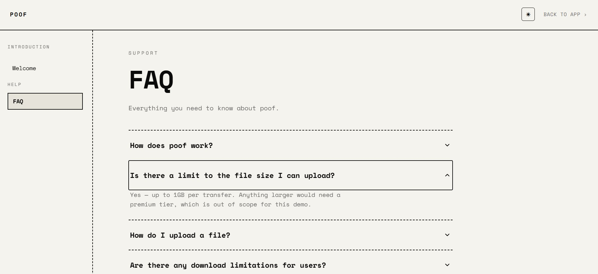
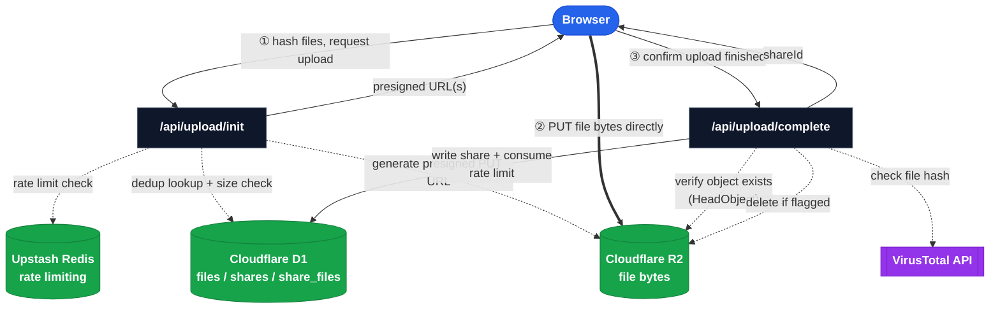
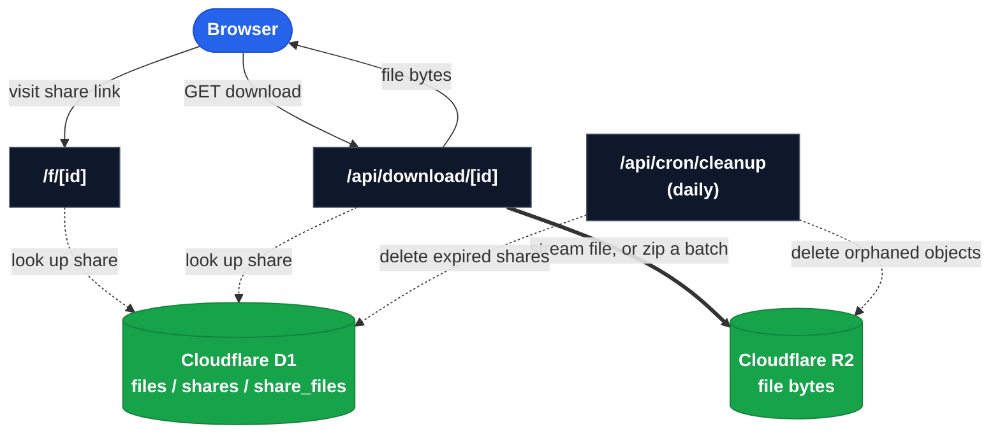

# poof

**Fast, secure file sharing that's gone in 24h.**

Live: [poof-file-sharing.vercel.app](https://poof-file-sharing.vercel.app)

Drop a file (or several), get a link, share it. No sign-up, no account, no trace — every file and every link is permanently deleted 24 hours after upload.

---

## Screenshots

| | Dark | Light |
|---|---|---|
| **Home** |  |  |
| **Upload** |  |  |
| **Download** |  |  |
| **FAQ** |  |  |

---

## Features

- **No sign-up, ever.** Drop a file, get a link. That's the entire flow.
- **Multi-file uploads.** Batch multiple files into a single share link; downloads as a zip, streamed on the fly (not buffered in memory).
- **Resumable downloads.** Single-file shares honor HTTP `Range` requests — an interrupted download resumes instead of restarting.
- **24-hour expiry, enforced.** Every file and its share link self-destruct exactly 24 hours after upload, cleaned up by an hourly-intentioned (Vercel Hobby-capped to once-daily) cron job.
- **Content-addressed deduplication.** Identical files (by SHA-256 hash) are stored once in R2 regardless of how many times or by how many people they're uploaded, while every upload still gets its own independent share link and expiry.
- **Malware scanning.** Every upload's hash is checked against VirusTotal; flagged files are deleted immediately and never become shareable.
- **Rate limiting & storage caps.** 3 uploads/day per IP, a 10GB total storage budget with an 80% kill switch, 1GB per single file / 2GB per batch.
- **No server in the middle of your bytes.** Files upload directly from the browser to object storage via short-lived presigned URLs — POOF's own server never touches your file's bytes in transit.

---

## Tech stack

| Layer | Choice |
|---|---|
| Framework | [Next.js 16](https://nextjs.org) (App Router, TypeScript) |
| Styling | CSS Modules (no UI framework) |
| File storage | [Cloudflare R2](https://www.cloudflare.com/developer-platform/products/r2/) (S3-compatible object storage) |
| Metadata database | [Cloudflare D1](https://developers.cloudflare.com/d1/) (serverless SQLite, accessed via REST API) |
| Rate limiting | [Upstash Redis](https://upstash.com/) (`@upstash/ratelimit`, sliding window) |
| Malware scanning | [VirusTotal API](https://www.virustotal.com/) (hash lookup) |
| Zip streaming | [`archiver`](https://www.npmjs.com/package/archiver) |
| Hosting | [Vercel](https://vercel.com) (serverless functions + cron) |

---

## Architecture

R2 is S3-compatible, so the same `@aws-sdk/client-s3` SDK is used to talk to it. D1 is accessed over its REST API (not the Workers binding) since POOF runs on Vercel, not Cloudflare Workers.

**Upload flow** — the interesting part, since file bytes never pass through POOF's own server:



**Download flow & cleanup** — unaffected by the upload rework, runs entirely independently:



**Why uploads go straight to R2, not through POOF's server:** Vercel enforces a hard 4.5MB request body limit on serverless functions. A real file-sharing app can't route multi-hundred-MB files through that. So the upload flow is two phases:

1. **`/api/upload/init`** — the browser computes each file's SHA-256 hash itself (Web Crypto API), then asks the server for permission to upload. The server checks the rate limit, the per-file/batch size caps, the storage kill-switch, and whether this hash already exists (dedup). For anything new, it returns a short-lived **presigned R2 URL**.
2. **Direct upload** — the browser `PUT`s the file's bytes straight to R2 using that URL. POOF's server is never in this request at all.
3. **`/api/upload/complete`** — the browser tells the server it's done. The server independently verifies the object actually landed in R2 (`HeadObjectCommand` — never trusts the browser's word alone), runs the VirusTotal check *now* that the file exists, deletes it immediately if flagged, and only then writes the share to the database.

---

## File structure

```text
src/
├── app/
│   ├── api/
│   │   ├── upload/
│   │   │   ├── init/route.ts       # validate + issue presigned R2 URLs
│   │   │   └── complete/route.ts   # verify upload, scan, write D1, create share
│   │   ├── download/[id]/route.ts  # stream single file (Range-capable) or zip a batch
│   │   └── cron/cleanup/route.ts   # delete expired shares + orphaned R2 objects
│   ├── f/[id]/page.tsx             # share/download page
│   ├── faq/page.tsx
│   ├── components/
│   │   ├── UploadForm.tsx          # the entire upload flow + fake progress bar
│   │   ├── Header.tsx
│   │   ├── Accordion.tsx
│   │   ├── CopyLinkButton.tsx
│   │   ├── Toast.tsx
│   │   └── ShareIcon.tsx
│   ├── layout.tsx
│   └── page.tsx                    # home
└── lib/
    ├── d1.ts                       # D1 REST API query helpers
    ├── r2.ts                       # R2 upload/download/presign helpers
    ├── ratelimit.ts                # Upstash rate limiter config
    └── virustotal.ts               # VirusTotal hash-lookup helper
```

---

## Data model

Three D1 tables, designed around content-addressed dedup:

- **`files`** — one row per unique file *content* (keyed by SHA-256 hash). `r2_key`, `size`, `content_type`.
- **`shares`** — one row per upload *event* (a batch). `share_id`, `created_at`, `expires_at`.
- **`share_files`** — join table: which files belong to which share, with the *original filename* for that particular upload (since the same content can be uploaded under different names by different people).

A file's underlying R2 object is reference-counted across `share_files` rows — the cleanup cron only deletes it from R2 once no active share references it anymore.

---

## Running locally

```bash
git clone https://github.com/shyamsinghnegi/POOF-File-sharing.git
cd POOF-File-sharing
npm install
cp .env.local.example .env.local   # fill in real credentials
npm run dev
```

You'll need accounts/credentials for: Cloudflare (R2 + D1), Upstash, and VirusTotal. See `.env.local.example` for the full list of required environment variables.

---

## Known limitations

- IP-based rate limiting can be bypassed by switching networks/devices — accepted, since closing it would require accounts, which conflicts with the no-signup goal.
- The cleanup cron runs once daily on Vercel's Hobby plan (its cron-frequency ceiling), so a file can outlive its stated 24h expiry by up to ~24h before actual deletion.
- Resumable downloads (`Range` requests) work for single-file shares but not zipped multi-file batches — a zip's final size isn't known until compression finishes, and byte-offset resume doesn't map cleanly to file boundaries inside a zip.
- "Remote Upload" (fetch a file from a URL without downloading it first) is a planned, not-yet-built feature.
